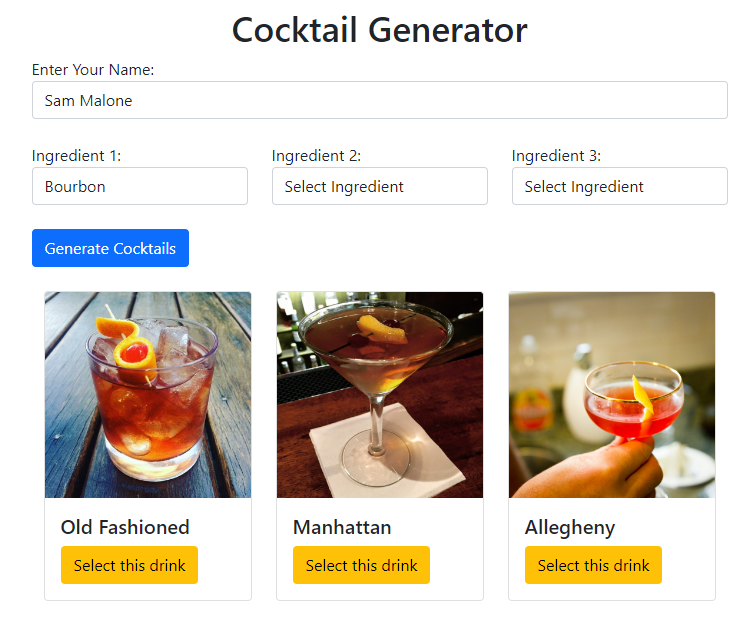

# PROJECT COCKTAIL

## Introduction:
Cocktail Explorer is a dynamic web application designed to simplify the journey of discovering new cocktail recipes. By leveraging the extensive Cocktails API, this application provides a user-friendly platform for cocktail enthusiasts to explore drinks based on their ingredient preferences.

## Key Features:
- Three-Ingredient Selection: Users can choose up to three ingredients from curated lists, crafted to inspire unique cocktail discoveries.
- Personalized User Experience: The app greets users with a personalized welcome message upon entering their name, adding a touch of customization to their experience.
- Smart Cocktail Matching: Once the ingredients are selected, the application queries the Cocktails API, matching the chosen ingredients with drink recipes. It displays a list of cocktails containing all the selected ingredients.
- Approval System: For each cocktail selected, users are informed whether the drink is 'approved' or 'not approved' based on a secret criteria, adding an interactive and engaging element to the recipe exploration.
- Favorites Management: Users have the option to save their favorite drinks for future reference. The favorites section allows for easy management, where users can view their saved drinks, unsave them if desired, and close the favorites section as needed.

## Contributors
Meredith McDonald
Daniel Brandt
Jonathan Blom
Austin Ries
Alex Geer

## Screenshot

## Link to deployed page
https://ag-bootcamp-umn.github.io/group-project-one/
